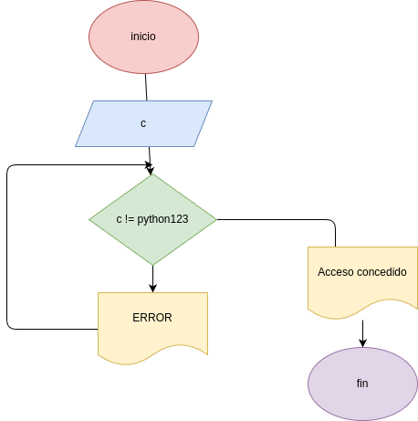

Ejercicio1 validador de contraseña

## Descripción
este programa esta hecho en python y utiliza un ciclo  while para validar una contraseña

## Funcionamiento
- el usuario ingresa una contraseña
- si la contraseña es incorrecta aparece " ERROR"
- el programa vuelve a pedir la contraseña
- cuando el usuario escribe "python123" aparece "acceso concedido"

## Codigo

password = input("ingrese la contraseña: )

while password != "python123":
   print("ERROR")
   password = input("ingrese la contraseña: ")

print("acceso concedido")

