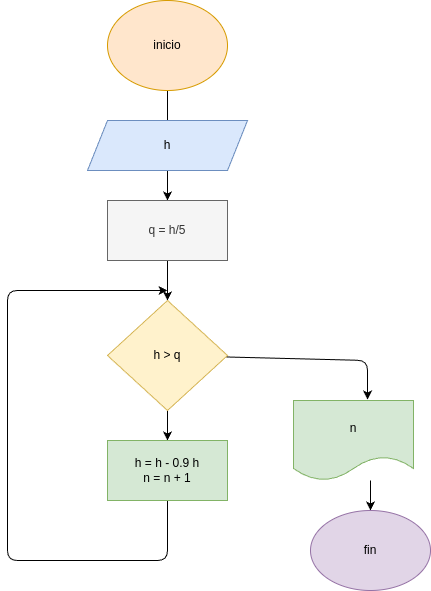

# EJERCICIO 4 - Rebote de una pelota

## Descripcion
una pelota se deja caer desde una altura inicial  h.
En cada rebote la pelota alcanza una altura 10% menor que la del  reboote anterior

El programa debe leer la altura inicial y calcular en que rebote la  pelota deja de alcanzar la  quinta parte de la  altura inicial

## Funcionamiento
1. El usuario ingresa la altura incial
2. Se calcula la  quinta parte de esa altura
3. En cada rebote la altura nueva es del 90% de la anterior
4. El proceso se repite usando un ciclo while
5. Cuando la altura es menor que la quinta parte de la  inicial, el programa muestra el numero de reobote

